# DocuMind — Grounded AI Document Intelligence & RAG Platform

<div align="center">


**Next-Generation Retrieval-Augmented Generation (RAG) platform for enterprise dossiers, financial reports, 10-K filings, and complex technical specifications.**

[](https://nextjs.org/)
[](https://react.dev/)
[](https://www.typescriptlang.org/)
[](https://expressjs.com/)
[](https://www.pinecone.io/)
[](https://www.inngest.com/)
[](https://tailwindcss.com/)
[](https://www.better-auth.com/)

[Features](#-key-features) • [Architecture](#-architecture--data-flow) • [Tech Stack](#-technology-stack) • [Quickstart](#-local-development-quickstart) • [Deployment](#-production-deployment-guide)

</div>

---

## 🌟 Key Features

- **⚡ Grounded Real-Time Streaming (SSE)**: Sub-350ms Time-To-First-Token (TTFT) via Server-Sent Events (SSE) and `ReadableStream`.
- **🛡️ Verifiable Source Attribution**: Strict anti-hallucination prompting with exact chunk index, document metadata, and similarity score citations.
- **🔄 Event-Driven Background Ingestion (Inngest)**: PDF and DOCX text extraction, chunking, and embedding offloaded to durable background serverless queues with automatic retry logic.
- **🌲 High-Precision Vector Retrieval (Pinecone)**: Multi-tenant vector partitioning, recursive semantic chunking, and cosine similarity recall.
- **🔐 Enterprise Authentication (BetterAuth)**: Google OAuth & credentials authentication, secure HttpOnly session cookies, Edge route protection middleware.
- **🎨 Glassmorphic Cyber UI**: High-contrast dark/light mode, responsive chat history sidebar with dynamic AI auto-titling, document preview modals, and analytics badges.

---

## 📐 Architecture & Data Flow

```mermaid
flowchart TD
    subgraph Client ["Client Layer (Vercel)"]
        User(["User Browser"])
        NextApp["Next.js 16 App Router"]
        EdgeMW["Edge Middleware (Route Guard)"]
        ChatUI["Streaming Chat UI (SSE Consumer)"]
    end

    subgraph Backend ["API Layer (Render)"]
        ExpressApp["Express 5 REST API"]
        BetterAuth["BetterAuth Session Engine"]
        InngestClient["Inngest Event Dispatcher"]
        RAGService["RAG Pipeline (LangChain + OpenRouter)"]
    end

    subgraph Background ["Async Processing (Inngest)"]
        InngestWorker["Inngest Background Worker"]
        Extractor["Document Text Extractor (pdf-parse / mammoth)"]
        Chunker["Recursive Character Text Splitter"]
        Embedder["Pinecone Vector Indexing"]
    end

    subgraph Storage ["Cloud Infrastructure"]
        MongoDB[("MongoDB Atlas (Users, Docs, Messages)")]
        Cloudinary[("Cloudinary (Secure Document Storage)")]
        PineconeDB[("Pinecone (Vector Index)")]
        OpenRouterLLM["OpenRouter (LLM Models)"]
    end

    %% Ingestion Flow
    User -->|1. Upload File| NextApp
    NextApp --> EdgeMW --> ExpressApp
    ExpressApp -->|2. Store File| Cloudinary
    ExpressApp -->|3. Save Metadata| MongoDB
    ExpressApp -->|4. Trigger documind/document.uploaded| InngestClient
    InngestClient --> InngestWorker
    InngestWorker --> Extractor --> Chunker --> Embedder --> PineconeDB
    InngestWorker -->|5. Update Status: INDEXED| MongoDB

    %% Query / Chat Flow
    User -->|6. Query Document| ChatUI
    ChatUI -->|7. SSE Stream Request| ExpressApp
    ExpressApp --> BetterAuth --> MongoDB
    ExpressApp --> RAGService
    RAGService -->|8. Cosine Similarity Query| PineconeDB
    PineconeDB -->|9. Top-K Chunks| RAGService
    RAGService -->|10. Grounded Context + Prompt| OpenRouterLLM
    OpenRouterLLM -->|11. Token Stream| RAGService
    RAGService -->|12. ReadableStream SSE| ChatUI
```



---

## 🛠️ Technology Stack

| Layer | Technologies |
| :--- | :--- |
| **Frontend** | Next.js 16.3 (App Router), React 19, TypeScript, Tailwind CSS v4, Motion, Lucide Icons, Tabler Icons |
| **State & Data Fetching** | TanStack React Query v5, Axios (`withCredentials`), React Hook Form, Zod |
| **Backend & Runtime** | Node.js 20+, Express 5, TypeScript, TSX |
| **Vector Database & AI** | Pinecone Vector Database, LangChain (`@langchain/textsplitters`), OpenRouter SDK |
| **Async Queues & Workers**| Inngest (Durable background workflows & step-function execution) |
| **Databases & Storage** | MongoDB Atlas (Mongoose), Cloudinary (Document storage & CDN) |
| **Authentication** | BetterAuth (MongoDB adapter, Google OAuth, Session Cookies) |

---

## 🚀 Local Development Quickstart

### Prerequisites

- **Node.js**: `v20.x` or higher
- **Package Manager**: `pnpm v10+` or `v11+`
- **MongoDB**: Local MongoDB instance or free MongoDB Atlas URI
- **Cloud Accounts**: Cloudinary, Pinecone, OpenRouter, Google Cloud Console (OAuth)

### 1. Clone the Repository

```bash
git clone https://github.com/Vaibhav5122/DocuMind.git
cd DocuMind
```

### 2. Backend Setup

```bash
cd backend
pnpm install

# Copy environment template
cp .env.example .env
# Fill in your credentials in backend/.env

# Start Backend Server & Inngest CLI
pnpm dev
# In another terminal:
pnpm inngest:dev
```
Backend API will be running on `http://localhost:8000`.

### 3. Frontend Setup

```bash
cd ../frontend
pnpm install

# Copy environment template
cp .env.example .env.local

# Start Next.js Development Server
pnpm dev
```
Frontend will be running on `http://localhost:3000`.

---

## 🌐 Production Deployment Guide

### Backend on Render (Web Service)

1. **Create Web Service**:
   - Link your GitHub repository on [Render](https://render.com).
   - **Root Directory**: `backend`
   - **Runtime**: `Node`
   - **Build Command**: `pnpm install`
   - **Start Command**: `pnpm start` (or `npx tsx src/index.ts`)
2. **Configure Environment Variables**:
   Add the variables from `backend/.env.example`:
   - `PORT`: `8000` (Render dynamically assigns this, `0.0.0.0` binding is already preconfigured in `backend/src/index.ts`)
   - `FRONTEND_URL`: `https://your-frontend.vercel.app` *(Must match your Vercel deployment URL)*
   - `MONGO_URI`: Your MongoDB Atlas connection string
   - `BETTER_AUTH_SECRET`: Secure random 32+ character string
   - `BETTER_AUTH_URL`: `https://your-backend.onrender.com`
   - `GOOGLE_CLIENT_ID` & `GOOGLE_CLIENT_SECRET`
   - `CLOUDINARY_CLOUD_NAME`, `CLOUDINARY_API_KEY`, `CLOUDINARY_API_SECRET`
   - `PINECONE_API_KEY`, `PINECONE_INDEX_NAME`, `PINECONE_HOST_URL`
   - `OPENROUTER_API_KEY`, `OPENROUTER_MODEL`
3. **Health Check Route**:
   - Set health check path to `/` (returns `{ status: "Healthy" }`).

### Frontend on Vercel

1. **Import Project**:
   - Import your GitHub repository on [Vercel](https://vercel.com).
   - **Root Directory**: Select `frontend`.
   - **Framework Preset**: `Next.js` (automatically detected).
2. **Configure Environment Variables**:
   - `NEXT_PUBLIC_API_BASE_URL`: `https://your-backend.onrender.com`
   - `NEXT_PUBLIC_APP_URL`: `https://your-frontend.vercel.app`
3. **Deploy**:
   - Click **Deploy**. Vercel will build the Next.js production bundle with Edge middleware, dynamic OpenGraph image generation, and robots/sitemap.

---

## 📂 Repository Structure

```
DocuMind/
├── backend/                  # Express 5 API Server & Inngest Workers
│   ├── src/
│   │   ├── app/              # Routes, controllers, models, middlewares, configs
│   │   ├── inngest/          # Background workflow functions & client
│   │   ├── lib/              # BetterAuth configuration
│   │   └── index.ts          # Server entrypoint (0.0.0.0 binding)
│   ├── .env.example          # Safe backend environment template
│   └── package.json
├── frontend/                 # Next.js 16 App Router UI
│   ├── public/               # Static assets & SVG logo
│   ├── src/
│   │   ├── app/              # App router (pages, layout, 404, robots, sitemap, og-image)
│   │   ├── components/       # UI primitives, chat views, dashboard tables, custom logo
│   │   ├── lib/              # Hooks, API clients, validations
│   │   └── middleware.ts     # Edge session protection middleware
│   ├── .env.example          # Safe frontend environment template
│   └── package.json
└── cookbook/                 # (Gitignored) 11 In-Depth System & Interview POV Guides
```

---

## 📄 License

This project is licensed under the MIT License — see the [LICENSE](LICENSE) file for details.